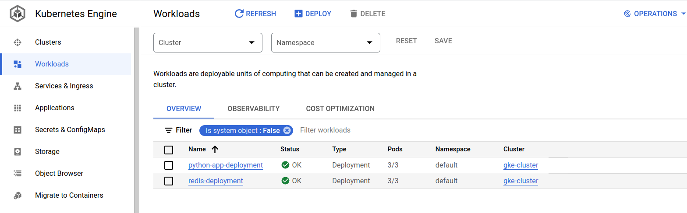
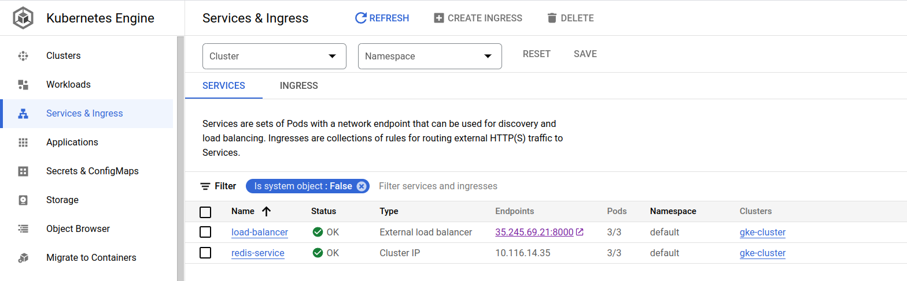
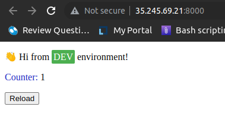

# GCP_project (Amr Elghazawy)

### Build Docker Image For The Pyhton App From The Dockerfile , And Upload The Image To GCR :

  * $ docker build gcp-python gcr.io/my-project-ghazooo/python_image
  * $ docker push gcr.io/my-project-ghazooo/python_image

### Pull Another Redis Image From Docker Hub Then Push It To GCR :

  * $ docker pull redis
  * $ docker tag redis gcr.io/my-project-ghazooo/redis_image
  * $ docker push gcr.io/my-project-ghazooo/redis_image


## Then, create the infrastructure using terraform

### Using Script.sh File When The VM Created Will Do : 

  * Install gcloud 
  * Install kubectl
  * Install gcloud plugin


### For Apply The Terraform Code :

  * $ terraform init
  * $ terraform plan 
  * $ terraform apply


## Then, shh to the VM to run the yaml files

```
 $ gcloud compute ssh --zone "us-east4-b" "private-vm-instance"  --tunnel-through-iap --project "my-ptoject-ghazooo"
```

```
$ gcloud compute scp --recurse /home/ghazooo/Desktop/GCP_project/kube_files private-vm-instance:/home/ghazooo  --zone "us-east4-b"   --tunnel
```


### Get The Load Balancer IP And Port And Test it :








